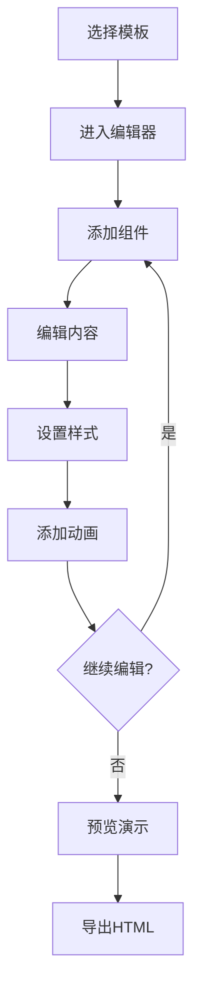

## 1. Product Overview

一个专业级的PPT HTML设计系统，能够生成与PPT大师级制作效果相当的交互式HTML演示文稿。系统支持多种主题模板、动画效果、图表展示，提供所见即所得的编辑体验和高质量的导出功能。

- **核心目标**: 让用户能够快速创建专业级别的演示文稿，兼具PPT的视觉效果和HTML的交互能力
- **目标用户**: 企业管理者、业务分析师、产品经理、培训讲师
- **市场价值**: 打破传统PPT的静态限制，提供更加丰富的交互体验和数据可视化能力

## 2. Core Features

### 2.1 User Roles
| Role | Registration Method | Core Permissions |
|------|---------------------|------------------|
| 用户 | 无需注册 | 创建、编辑、预览、导出演示文稿 |

### 2.2 Feature Module
1. **编辑器页面**: 主编辑界面，包含画布、工具栏、属性面板
2. **模板选择**: 多种预设主题模板（商务、科技、教育、创意等）
3. **组件库**: 文本框、图片、图表、形状、表格等组件
4. **动画效果**: 入场动画、过渡动画、强调动画
5. **预览模式**: 全屏演示预览，支持翻页控制
6. **导出功能**: 导出为HTML文件，支持离线浏览

### 2.3 Page Details
| Page Name | Module Name | Feature description |
|-----------|-------------|---------------------|
| 编辑器页面 | 顶部工具栏 | 撤销/重做、保存、预览、导出、主题切换 |
| 编辑器页面 | 左侧组件面板 | 组件列表（文本、图片、图表、形状、表格、媒体） |
| 编辑器页面 | 中间画布 | 幻灯片编辑区域，支持拖拽、缩放、对齐 |
| 编辑器页面 | 右侧属性面板 | 当前选中组件的属性设置（样式、动画、数据） |
| 编辑器页面 | 底部幻灯片缩略图 | 幻灯片列表，支持添加、删除、排序 |
| 预览页面 | 全屏演示 | 全屏显示，键盘导航，自动播放 |

## 3. Core Process

## 4. User Interface Design

### 4.1 Design Style
- **主色调**: 深蓝 #1e3a5f、科技蓝 #0ea5e9、商务灰 #374151
- **辅助色**: 成功绿 #22c55e、警告橙 #f97316、危险红 #ef4444、信息蓝 #3b82f6
- **按钮风格**: 圆角矩形，渐变背景，hover效果
- **字体**: Inter（标题）、Roboto（正文）、Noto Sans SC（中文）
- **布局风格**: 卡片式布局，左侧组件面板，右侧属性面板，中间画布
- **图标风格**: Lucide React，线性风格

### 4.2 Page Design Overview
| Page Name | Module Name | UI Elements |
|-----------|-------------|-------------|
| 编辑器页面 | 顶部工具栏 | 圆角按钮组，图标+文字，hover高亮效果 |
| 编辑器页面 | 左侧组件面板 | 网格布局，卡片式组件图标，拖拽提示 |
| 编辑器页面 | 中间画布 | 白色背景，灰色参考线，组件选中边框高亮 |
| 编辑器页面 | 右侧属性面板 | 标签页切换，表单输入，实时预览 |
| 编辑器页面 | 底部缩略图栏 | 横向滚动，选中状态高亮，拖拽排序 |
| 预览页面 | 全屏演示 | 黑色背景，幻灯片居中，导航箭头淡入淡出 |

### 4.3 Responsiveness
- **桌面端**: 完整三栏布局，画布最大化
- **平板端**: 左右面板可折叠，画布自适应
- **移动端**: 简化工具栏，组件面板改为底部弹出

### 4.4 动画效果
- **组件入场**: 淡入、缩放、滑动、旋转
- **页面过渡**: 淡入淡出、滑动切换、立方体翻转
- **强调动画**: 脉冲、弹跳、闪烁、高亮
