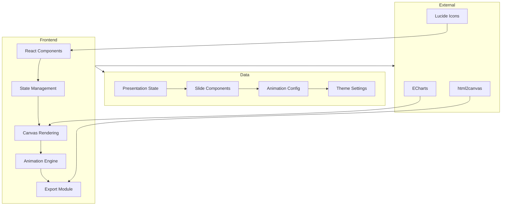
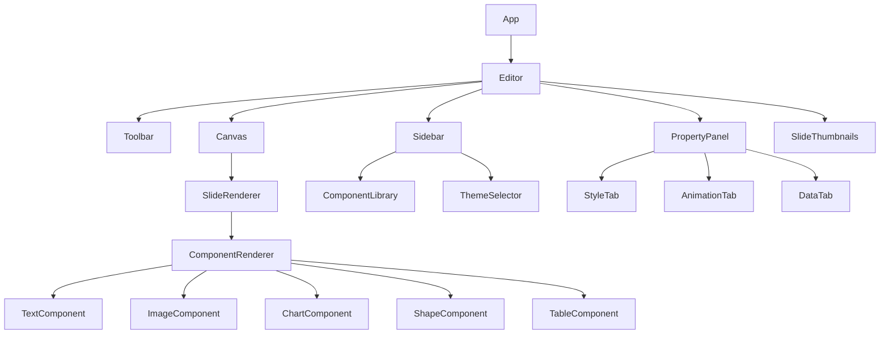

## 1. Architecture Design



## 2. Technology Description

- **Frontend**: React@18 + TypeScript + TailwindCSS@3 + Vite
- **State Management**: Zustand
- **Charting**: ECharts + echarts-for-react
- **Icons**: Lucide React
- **Animation**: CSS Animations + Framer Motion
- **Export**: Custom HTML generation module
- **Initialization Tool**: vite-init

## 3. Route Definitions

| Route | Purpose |
|-------|---------|
| / | 主编辑器页面 |
| /preview | 全屏预览模式 |

## 4. API Definitions

### 4.1 Presentation State Schema

```typescript
interface Presentation {
  id: string;
  title: string;
  theme: ThemeType;
  slides: Slide[];
}

interface Slide {
  id: string;
  index: number;
  backgroundColor: string;
  components: Component[];
  transition: TransitionType;
}

interface Component {
  id: string;
  type: ComponentType;
  x: number;
  y: number;
  width: number;
  height: number;
  content: string;
  style: StyleConfig;
  animation: AnimationConfig;
}

type ComponentType = 'text' | 'image' | 'chart' | 'shape' | 'table' | 'media';
type ThemeType = 'business' | 'tech' | 'education' | 'creative' | 'dark';
type TransitionType = 'fade' | 'slide' | 'cube' | 'zoom';

interface AnimationConfig {
  type: 'fadeIn' | 'slideInLeft' | 'slideInRight' | 'slideInTop' | 'slideInBottom' | 'zoomIn' | 'rotateIn';
  delay: number;
  duration: number;
  easing: 'ease' | 'easeIn' | 'easeOut' | 'easeInOut';
}

interface StyleConfig {
  fontFamily: string;
  fontSize: number;
  fontWeight: string;
  color: string;
  backgroundColor: string;
  borderRadius: number;
  borderWidth: number;
  borderColor: string;
  shadow: string;
}
```

## 5. Component Structure



## 6. Data Model

### 6.1 Theme Definitions

| Theme | Primary | Secondary | Background | Text | Accent |
|-------|---------|-----------|------------|------|--------|
| Business | #1e3a5f | #0ea5e9 | #ffffff | #1f2937 | #3b82f6 |
| Tech | #0f172a | #8b5cf6 | #0f172a | #e2e8f0 | #06b6d4 |
| Education | #7c3aed | #f97316 | #ffffff | #374151 | #ec4899 |
| Creative | #ec4899 | #06b6d4 | #ffffff | #1f2937 | #8b5cf6 |
| Dark | #111827 | #374151 | #0f172a | #f9fafb | #0ea5e9 |

### 6.2 Animation Presets

| Name | Type | Duration | Delay |
|------|------|----------|-------|
| Fade In | fadeIn | 500ms | 0ms |
| Slide In Left | slideInLeft | 600ms | 100ms |
| Slide In Right | slideInRight | 600ms | 100ms |
| Slide In Top | slideInTop | 600ms | 100ms |
| Slide In Bottom | slideInBottom | 600ms | 100ms |
| Zoom In | zoomIn | 500ms | 150ms |
| Rotate In | rotateIn | 700ms | 200ms |

## 7. Export Format

### 7.1 HTML Structure

```html
<!DOCTYPE html>
<html lang="zh-CN">
<head>
  <meta charset="UTF-8">
  <meta name="viewport" content="width=device-width, initial-scale=1.0">
  <title>[Presentation Title]</title>
  <link href="https://fonts.googleapis.com/css2?family=Inter:wght@400;500;600;700&display=swap" rel="stylesheet">
  <script src="https://cdn.jsdelivr.net/npm/echarts@5.4.3/dist/echarts.min.js"></script>
  <style>/* Generated CSS */</style>
</head>
<body>
  <div class="presentation">
    <!-- Slides -->
    <div class="slide" data-transition="fade">
      <!-- Components with animations -->
    </div>
  </div>
  <script>/* Navigation and animation scripts */</script>
</body>
</html>
```
