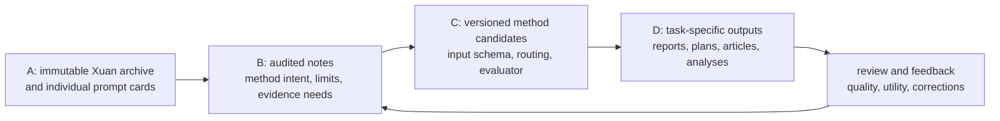

# Xuan Skill Package Architecture Audit

## Scope And Evidence

- Audited archive: `Xuan酱Skill包.zip` supplied by the user on 2026-07-23.
- Archive shape: 73 entries, of which 27 are substantive Markdown prompt cards. The remainder is empty directory data, macOS `__MACOSX` sidecars, and `.DS_Store` metadata.
- There is no `SKILL.md`, executable code, tool declaration, JSON schema, dependency manifest, test, evaluator, or installation entrypoint.
- Some ZIP filenames use a legacy encoding and are not reliable on Windows. The Markdown frontmatter `aliases` are readable and are the reliable semantic identifiers used below.

## Executive Finding

This is an Obsidian prompt-card library, not an executable Skill ecosystem. It has useful domain patterns, but direct import as BSC Skills would reproduce the current failure mode: selecting a fixed template before understanding the user's goal, evidence, audience, constraints, and desired outcome.

The package should be treated as an immutable A-layer reference corpus and a source of C-layer method candidates. It must not be treated as a set of pre-approved agents or default SOPs.

## Corpus Topology

| Domain | Cards | Value | Readiness |
|---|---|---|---|
| Knowledge and writing | Article summary, content expansion, evergreen note, STAR | Useful composition and knowledge-note patterns | Candidate only |
| Marketing frameworks | PAS, AIDA, SCQA, SCAMPER, FAB | Clear rhetorical lenses and ideation moves | Candidate only |
| Decision and planning | 9: Pyramid, Six Hats, SWOT, scenario planning, OKR, pros/cons, four-dimensional value, decision tree, 5 Why | Strongest reusable reasoning material | Selectively compile |
| Reporting | Daily report, weekly report | Rich audience/format variants | Renderer patterns only |
| Story structures | Hero's journey, three-act, five-act | Narrative composition options | Renderer patterns only |
| Xiaohongshu content | List, experience, tutorial, product recommendation | Channel-specific voice and layout choices | Renderer patterns only |

## What Is Worth Preserving

### 1. Taxonomy And Retrieval Signals

Every card has Obsidian frontmatter with aliases, tags, and a parent concept. This is a useful seed for BSC's category, task-family, and retrieval metadata. It separates reasoning methods, reporting, marketing, and narrative rather than calling all of them generic "writing skills".

### 2. Decision Tree And 5 Why Have Real Method Cores

The decision-tree card requires explicit options, outcomes, probabilities, payoffs, risk tolerance, sensitivity analysis, non-quantitative factors, and action checkpoints. The 5 Why card has a causal chain, evidence column, root-cause classification, countermeasures, monitoring, and validation. These are closer to operational methods than to prose templates.

They still need typed inputs, calculation validation, evidence references, and falsification conditions before BSC may publish them as C-layer methods.

### 3. Evergreen Note Has The Right Intent

The evergreen-note card aims to turn a topic into durable, linked, tagged knowledge rather than a disposable answer. This matches the product's B-layer direction and Karpathy-style A -> B -> C -> D loop.

Its implementation is unsafe for the target product: it demands at least 120 sentences, invents a fixed set of related notes, does not require citations, and asks the model to ignore token limits. The intent should be retained while the prompt itself is replaced.

### 4. Reporting Cards Encode Audience Differences

The weekly report distinguishes individual, project, management, and promotion scenarios. This is useful as a selection policy: audience and decision need should choose the shape of a report. It must not choose a report merely because the user said "write a weekly report".

## Structural Defects That Block Direct Adoption

| Defect | Evidence In The Package | Consequence In BSC | Required Correction |
|---|---|---|---|
| No executable contract | No `SKILL.md`, tools, schemas, or tests | Cannot compose, validate, or safely dispatch a card | Compile each approved method to a versioned `MethodSpec` |
| Template-first behavior | Weekly report includes many fixed forms; Xiaohongshu cards are fixed layouts | Produces interchangeable content and ignores project context | Select method only after profiling the task, audience, source coverage, and success metric |
| No provenance | Most cards do not require sources or citations | Hallucinated facts can enter Wiki or outputs | Require eligible A sources or published B pages for factual claims |
| No evaluation gate | Checks are prose advice, not executable criteria | No way to compare revisions or reject degradation | Add factuality, coverage, style-fit, and user-feedback evaluators |
| Unsafe reasoning request | Six Hats asks for chain-of-thought style output | Encourages verbose hidden-reasoning imitation rather than auditable conclusions | Output concise per-lens findings, assumptions, evidence refs, and recommendation only |
| Arbitrary length rules | Evergreen note requires 120+ sentences; templates prescribe extensive filler | Rewards volume, not user value | Use bounded objectives and stop criteria based on unanswered questions and evidence coverage |
| Invented linking | Evergreen note mandates many related note links | Creates fabricated knowledge-graph edges | Permit links only to existing published pages or explicit proposed pages |
| Missing uncertainty model | Decision, marketing, and content cards mostly treat inputs as facts | False confidence in recommendations | Separate evidence, estimate, assumption, and user preference in every output |
| Archive hygiene | macOS sidecars and legacy filename encoding are present | Import noise and unstable paths | Capture original archive once, normalize aliases, ignore sidecars; use content hash plus normalized alias as the import identity rather than the ZIP path or extension |

## BSC Mapping



### A Layer: Preserve, Do Not Execute

Store the ZIP and extracted Markdown as immutable source records with `source_type=manual_upload` or the declared Obsidian Importer bridge. Preserve original aliases and tags. Do not convert an alias into an active capability during import.

### B Layer: Create Audited Concept Notes

Each card should receive a short note answering:

- What problem does this method solve?
- What inputs are mandatory versus optional?
- Which claims need external evidence?
- When should the method be rejected or replaced?
- Is it an analysis method, a composition renderer, or only reference material?

The note must cite its original prompt-card source and must not restate the card as accepted operating policy without review.

### C Layer: Compile Only Methods With Operational Semantics

Start with these method candidates:

| Candidate | Task Family | Required Upgrade |
|---|---|---|
| 5 Why | Incident, process, and project retrospective | Causal evidence chain, counterfactual check, action owner and verification deadline |
| Decision tree | Investment, product, and strategy choice | Typed outcome model, probability validation, payoff calculation, sensitivity test, risk-utility choice |
| SCQA and Pyramid | Brief, PRD, and executive communication | Claim/source matrix and audience-specific information hierarchy |
| SWOT and scenario planning | Strategy exploration | Assumption register, scenario triggers, evidence thresholds, no automatic recommendation |
| OKR | Goal design | Baseline, measurable key-result validator, owner, deadline, dependency and review cadence |
| Evergreen note | Knowledge distillation | Existing-page-only links, citation coverage, freshness/contradiction checks, bounded synthesis |

Marketing, story, Xiaohongshu, STAR, daily report, and weekly report cards should initially be C-layer renderers. They can shape a D-layer artifact only after a task-specific context pack has selected the audience, objective, evidence, constraints, and quality bar.

## Required MethodSpec Contract

Every approved card needs a replacement contract rather than a larger prompt:

```yaml
id: decision-tree
version: 1
kind: analysis_method
requires:
  - decision_question
  - alternatives
  - risk_preference
evidence_policy:
  factual_claims: eligible_sources_or_published_pages
  estimates: explicit_assumption_with_owner
stages:
  - normalize_inputs
  - validate_probabilities
  - calculate_outcomes
  - run_sensitivity_cases
  - compose_recommendation
output_schema:
  decision_record: object
  assumptions: array
  evidence_refs: array
  action_plan: array
evaluation:
  - probabilities_sum_to_one
  - every_factual_claim_has_ref
  - recommendation_matches_risk_preference
  - sensitivity_case_present
```

The same contract shape should be used for 5 Why, OKR, and evergreen notes. Renderers use a reduced contract that explicitly states they cannot create factual claims without a selected context pack.

## Routing Policy For Non-Templated SOPs

1. Profile the request: user role, target reader, decision or content goal, time horizon, channel, project constraints, risk, and success metric.
2. Build context from project-local eligible A evidence, relevant published B pages, accepted C method revisions, and accepted D examples as style-only references.
3. Select no more than one primary reasoning method and one optional renderer. A report template is never a reasoning method.
4. Produce a structured draft with source citations, assumptions, open questions, and a declared method revision.
5. Evaluate factual coverage, task fit, diversity from prior outputs, and user feedback before filing the artifact.
6. Promote a method revision only after repeated, positive, evidence-backed use. Do not promote a prompt card because it has a familiar name.

## Adoption Gates

- Reject any prompt requesting chain-of-thought disclosure, unlimited generation, invented links, invented data, or unsupported claims.
- Reject generic output where the same content would fit unrelated projects after replacing the title.
- Require a test fixture and a negative case before a candidate becomes an active BSC method.
- Keep the source archive separate from active methods so a rollback disables a method revision without erasing its learning history.
- Count method usage and evaluation outcomes by project. A globally popular template is not automatically suitable for this user's project.

## Recommended Next Implementation Slice

Do not bulk-import all 27 cards into the active Skills page. Build a candidate-method importer that creates draft C-layer records from selected source cards, then implement and evaluate three high-leverage methods in order:

1. `5why-governed-retrospective`
2. `decision-tree-with-sensitivity`
3. `evergreen-note-with-citation-and-existing-links`

This produces a real method-evaluation loop and keeps content renderers optional. After those methods have project-specific evaluations, add SCQA/Pyramid for PRD and executive briefs, then channel-specific renderers for content creation.
