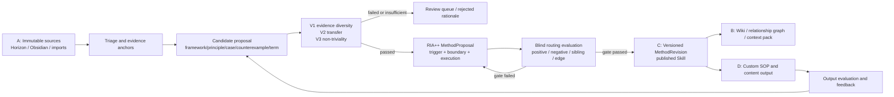

# Cangjie Skill 方法论深度审计与 BSC 接入建议

> 审计日期：2026-07-25
> 输入：`C:\Users\34216\Downloads\cangjie-skill-main.zip`
> SHA-256：`BA793DBE7EF2E2851E4156CD4283387492E64F6333A6847E84CDE9B32D605E95`
> 审计范围：静态阅读压缩包全部源码、提示词、模板和 GitHub Workflow；未安装、未执行、未导入凭据。

## 1. 结论

`cangjie-skill` 不是知识库、Agent 运行时或插件。它是一个用于把长内容蒸馏成可调用 Markdown Skill 的**提示词方法论包**。包内有 41 个归档条目，展开约 4.95 MB；没有依赖清单、服务进程、数据库迁移、API、索引器、调度器或真正的测试执行器。

它最值得吸收的不是 `books/<slug>/` 文件布局，而是四条质量规则：

1. **候选与发布分离**：先广泛提取，不把每一段“看似有道理”的话直接做成方法。
2. **反例和边界是一等资产**：方法必须说明何时不能用，不能只写正面提示词。
3. **触发契约可测试**：每个方法既要有应触发样例，也要有不应触发和相邻方法混淆样例。
4. **产物应回到真实宿主**：只有被评测、发布并被真实 SOP/内容产出使用的 Skill 才有价值。

BSC 已经实现了这份包没有的核心治理能力：项目隔离、不可变证据哈希、提案、评测、版本化发布、原子 materialization、回滚、运行审计、知识图、周蒸馏和有边界的上下文包。因此正确的接入方式是将其提炼为 **BSC C 层方法资产的质量标准**，而不是复制其目录、把 Markdown 文件当成第二套权威数据库，或把“提示词写出来了”误报为“方法已经验证”。

## 2. 包结构与安全结论

### 2.1 静态构成

| 区域 | 内容 | 真实职责 |
| --- | --- | --- |
| `SKILL.md` | 总控提示词 | 规定七阶段蒸馏流程和交付格式 |
| `methodology/` | 8 份 Markdown | Adler 阅读、五路提取、三重验证、RIA++、链接、压力测试、交付 |
| `extractors/` | 5 份 Markdown | 框架、原则、案例、反例、术语的候选提取提示词 |
| `templates/` | Markdown/JSON 模板 | 概览、索引、摘要、Skill 和测试样例 |
| `scripts/generate_star_history.py` | 单个 Python 脚本 | 使用 GitHub Token 读取 Star 时间线并写入 SVG 图表 |
| `.github/workflows/update-star-history.yml` | 单个工作流 | 每日运行上述 Star 图表脚本并提交 SVG |
| `assets/` | 说明性图片和字体 | README 展示用途，与知识蒸馏无运行关系 |

### 2.2 安全审计

- ZIP 条目路径检查通过：没有绝对路径和 `..` 路径穿越条目。
- 没有安装脚本、二进制、网络爬虫、数据库或隐藏的运行时依赖。
- 唯一可执行代码是 Star History 脚本。它调用 GitHub REST API，读取 `GITHUB_TOKEN`/`GH_TOKEN`，将 SVG 写到指定输出路径；其 GitHub Workflow 需要 `STAR_HISTORY_TOKEN` 并有仓库写权限。
- 该图表脚本与知识蒸馏没有业务关系，不应进入 BSC 的知识运行、Horizon、Obsidian 或自动化链路，也不应配置其 Token。
- 包内引用长度限制（每段中文不超过 150 字、英文不超过 100 词）只能降低摘录量，**不能替代版权、来源许可和项目资料访问权限判断**。

## 3. RIA-TV++ 的真实工作方式

### 阶段 0：Adler 整体理解

先做结构、解释、批判、应用潜力四个动作。它要求在抽取前写出内容骨架、术语、论证、作者立场/时代局限，以及哪些内容可 Skill 化。这一步的真正价值是：把“作者的观点”与“可迁移且有边界的方法”分开。

### 阶段 1：五路独立候选提取

五个提取器从同一份原文和概览中分别抽取：

- 框架：如何思考或决策；
- 原则：何时做/不做的规则或清单；
- 案例：作者实际如何使用某种方法；
- 反例：失败机制、预警信号和不适用条件；
- 术语：作者专有语义，防止下游把术语按日常含义误解。

这个阶段明确“宁可多收候选、不做筛选”。长内容按自然章节切块，每块带同一份全局概览，并在汇总时保留多个出处。它的合理点是让不同视角先独立工作，避免早期互相污染。

### 阶段 1.5：V1/V2/V3 三重验证

候选被去重后必须全部通过：

- **V1 跨情境证据**：至少有两个独立章节、对象或案例的支持，不能把同一案例改写两次计算。
- **V2 外推能力**：能够回答来源中没有直接讨论的新问题，且结论不平庸。
- **V3 独特性**：不只是通用常识，而是可识别的反直觉结构、独特术语或差异化判断。

未通过的候选不应被删除，应降级为例子、术语或被拒绝记录，并保留具体失败理由。这是包中最正确的“反模板化”机制：高覆盖并不等于全部发布。

### 阶段 2：RIA++ 原子方法

每个通过单元被组装为六部分：

| 部分 | 含义 | 对执行的约束 |
| --- | --- | --- |
| R | Reading | 可追溯的短出处 |
| I | Interpretation | 用自己的语言重建机制，不能变成书摘 |
| A1 | Past Application | 来源中的真实案例和结果 |
| A2 | Future Trigger | 具体任务信号、应调用条件、相邻方法的初步区分 |
| E | Execution | 带完成标准和判停条件的步骤 |
| B | Boundary | 负触发、失败模式、作者盲点、易混淆的方法 |

其中 A2 和 B 最重要。A2 决定一个方法会不会在对的任务上被选中；B 决定它不会在错误场景上抢占控制权。只有“关于 X 的 Skill”不是触发契约。

### 阶段 3：Zettelkasten 关系图

包只定义三种有意义的边：`depends-on`、`contrasts-with`、`composes-with`。它要求把边反填到每个 Skill 的描述中，并以关系图反推学习顺序。它也强调不能为图谱密度硬造边，这是正确的。

### 阶段 4：压力测试

每个 Skill 生成 `test-prompts.json`，包含 3 至 5 个应触发、2 至 3 个不应触发、1 至 3 个边界用例；不应触发用例中必须有一个实际应触发兄弟 Skill 的混淆题。建议使用没有参与蒸馏的独立 Agent 盲测，并根据失败回炉 RIA++，而不是只润色 description。

这是其最能提升真实可用性的部分。大多数模板化知识库只测“能否回答”，从不测“该不该调用”，因此会出现内容看起来完整但实际任务路由不断误判的问题。

### 阶段 5：交付

流程最后产生面向阅读者的 Digest 并安装通过测试的 Skill 到 Claude/Cursor 目录。其意图正确：不接入真实运行环境的知识产物没有闭环价值。

## 4. 这份包不能直接作为 BSC 实现的原因

### 4.1 它是约定，不是强制执行

所有质量线都写在 Prompt 中。没有代码保证候选有两个独立证据，没有解析器校验 YAML，没有状态机阻止未测 Skill 被复制，没有任务运行记录，也没有失败后的真正重试。模型完全可能输出“通过”字样而没有做验证。

### 4.2 没有原始资料的证据和权限模型

候选只保留 `source_quote` 和 `source_chapter`，没有 `SourceRecord.content_hash`、来源抓取时间、访问权限、信任等级、版本冻结、来源变更或跨项目越权保护。对于 Obsidian、Horizon、飞书、网页和会议纪要并存的系统，这不足以保证结论可靠。

### 4.3 V1/V2/V3 仍是人工判断，不是可审计评测

V1 的“跨域”实际是来源内部的多处语境，不等于跨来源事实核验。V2 和 V3 没有固定评测集、评分器版本、输入快照、运行 ID 或独立评审记录。因此它们只能成为 BSC 的评测维度，不能直接当作发布事实。

### 4.4 无法处理真实并发和发布问题

包没有项目锁、乐观并发控制、原子写入、提案基线、回滚指针、幂等键、可恢复调度、审计事件和服务身份。两个 Agent 同时修改同一个 Skill 时，或者用户手工编辑同一文件时，没有可靠的冲突模型。

### 4.5 `books/` 不应成为第二权威来源

直接复刻 `books/<slug>/candidates/` 会让源资料、候选、Wiki、已发布方法、实际输出散落为多份文件事实。BSC 已经确定 A/B/C/D 的权威边界，应由数据库和受管 Vault 的版本记录管理，而不是用一套新目录绕开门禁。

### 4.6 缺少 Prompt 注入和不可信内容处理

它把原书文本直接交给提取器，没有将资料内容声明为不可信数据，也没有对“忽略上面指令”“写入密钥”等文本做隔离。BSC 的 `GrowthContextBuilder` 已有来源清洗、引用和受限上下文策略；任何接入必须复用这一边界。

## 5. 与 BSC 现有能力的精确映射

| Cangjie 概念 | BSC 权威实体/组件 | 接入规则 |
| --- | --- | --- |
| 原文、转写、截图 OCR、Horizon 条目 | `SourceRecord` + A 层 Vault | `raw_content` 和 `content_hash` 不被蒸馏任务改写；使用 `trust_level`、状态和项目 ID 控制准入 |
| Adler 概览、框架/原则/案例/反例/术语候选 | `WikiProposal` 或受管候选页面 | 只能是带 `source_ids` 的候选提案，不能直接覆盖 Wiki 或方法库 |
| V1 多出处 | `CitationLink` + Wiki lint/图谱 | 每个独立证据必须有不同锚点与可解析来源 ID；同一片段不能重复计数 |
| V2 外推、V3 独特性 | `MethodProposal.eval_summary` + `method_evaluator.py` | 作为持久化评测维度，记录案例、评分器版本、证据、失败原因和运行 ID |
| RIA++ Skill | `MethodAsset`、`MethodRevision`、`MethodRegistry` | `applicability` 对应 A2 正触发，`exclusions` 对应 B 负触发；正文和 manifest 保存 R/I/A1/E/B |
| 候选/拒绝审计 | `MethodProposal`、提案状态、运行事件 | 拒绝也保留理由，不允许“静默丢掉”候选 |
| 关系图 | `KnowledgeGraphService` 与 lineage edge | 只写 `depends-on`、`contrasts-with`、`composes-with` 的有证据关系；不以图密度为指标 |
| `test-prompts.json` | 方法评测用例和 `method_gate.py` | 正触发、负触发、边界、兄弟混淆全部进入发布门禁，而非仅存到文件 |
| 安装 Skill | `MethodRegistry.publish_proposal()` | 只 materialize 已通过门禁的不可变 `MethodRevision`；发布记录关联 proposal、revision、gate 元数据 |
| Digest | `GrowthDistillationService` 的受管周蒸馏 | 生成内容必须带引用账本，不能伪称运行、发布或来源事实 |
| 真实 SOP/内容反馈 | `OutputAsset`、`OutputEvaluation`、反馈路由 | D 层结果可提出方法修订，但不能自动覆写 C 层已发布方法 |

现有数据结构已经恰当地表达了大部分治理基础：

- `SourceRecord` 保存项目 ID、来源类型、原始内容、哈希、信任等级、状态和 supersedes 关系；
- `MethodAsset` 有独立候选/发布状态、正适用条件和 exclusions；
- `MethodRevision` 保存不可变正文、manifest、评测摘要和版本；
- `MethodProposal` 把操作、来源输出、理由和评测结果留在发布前；
- `MethodRegistry` 已对发布版本、提案不可变性、并发冲突和 Vault materialization 进行保护；
- `GrowthContextBuilder` 已按 B -> A -> C -> D/review 构建有引用、有限预算、排除未批准方法和被拒绝产物的上下文。

## 6. 应增加的“方法蒸馏契约”

在后续实现中，应在现有 `MethodProposal.manifest` 中引入版本化的 `distillation` 段，而不是新造旁路文件。建议最小形状如下：

```yaml
distillation:
  contract_revision: cangjie-ria-tvpp-v1
  source_kind: book | transcript | collection | project-output
  candidate_type: framework | principle | checklist | procedure
  evidence:
    - source_id: source-001
      anchor: chapter-3
      claim: "..."
      content_hash: "..."
  critical_review:
    author_assumptions: []
    failure_modes: []
    validity_limits: []
  trigger_contract:
    should_trigger: []
    should_not_trigger: []
    sibling_confusion: []
    edge_cases: []
  evaluations:
    v1_evidence_diversity: pending
    v2_transfer: pending
    v3_non_triviality: pending
    trigger_precision: pending
  relation_assertions: []
```

关键约束：

1. 一个方法提案至少引用两个非重复证据锚点，或明确标记为“单来源假设，不允许自动发布”。
2. `should_not_trigger` 任一失败都阻断发布；不能用平均分掩盖错误路由。
3. “兄弟方法”测试必须从同一项目的当前已发布方法集合中选择，不能编造不存在的 Skill。
4. V2 的测试问题必须在方法生成前冻结，或至少记录生成时间和评审上下文，避免事后为了通过而修改题目。
5. V3 只能支持“值得保留/需要人工审查”的决策，不能声称数学上证明了独特性。
6. 所有来源片段传给模型前按现有不可信内容清洗规则处理；来源文本无权改变系统指令、发布状态或权限。

## 7. 推荐的受管流程



该流程保留 Cangjie 的有效思想，但强化了 BSC 的事实边界：

- A 层负责“资料是真的、可追溯、未被改写”；
- 候选和验证负责“这是否值得成为方法”；
- C 层负责“可调用的方法到底是哪一个可回滚版本”；
- B 层负责“人和 Agent 可读的知识组织与关系”；
- D 层负责“真实任务的产出和反馈”，但不会反写历史事实。

## 8. 落地缺口与优先级

### 可立即复用，禁止重造

- A/B/C/D 的项目边界、Vault 映射和知识运行审计；
- `SourceRecord` 哈希、来源状态、引用、Wiki Proposal 和发布/回滚；
- `MethodAsset`/`MethodRevision`/`MethodProposal` 的版本化方法库；
- `MethodRegistry` 的原子发布和并发检查；
- `GrowthContextBuilder` 的上下文预算、项目作用域和不可信资料处理；
- 周蒸馏、输出评测、反馈回流和 Studio 可视化。

### 应作为后续实施项，而非假定已完成

1. **结构化候选提取运行器**：真正生成框架、原则、案例、反例、术语五类候选，并保存来源锚点与每次运行证据。
2. **RIA-TV++ 评测适配器**：把 V1/V2/V3 和触发/负触发/兄弟混淆用例写入方法提案的持久评测，而不是 Markdown 自评。
3. **独立盲测执行器**：评测 Agent 只能看到当前发布候选的可调用描述和测试输入，不能看到 expected outcome；没有可用独立执行器时，运行必须明确标为低置信度 fallback。
4. **方法关系断言和图谱渲染**：支持稀疏、可审查、可回滚的三类关系，而不是自动把所有节点连线。
5. **Studio 审查面板**：同时展示基线、提案 Diff、证据、拒绝原因、评测用例、运行事件和发布门禁，避免只展示漂亮卡片。

在上述五项完成并通过端到端验证前，只能说“BSC 已具备接入基础”，不能说“Cangjie 蒸馏流水线已经上线”。

## 9. 验收门槛

一个真实来源经这条链路走完，至少应满足：

- 原始资料可用 `SourceRecord.id + content_hash` 追溯，原内容不被改写；
- 至少有一个结构化候选与两个可解析证据锚点；
- V1/V2/V3 的输入、结果、失败理由、评测器版本和运行 ID 都可审查；
- 生成的方法包含正触发、负触发、边界和至少一个真实兄弟混淆测试；
- 门禁拒绝时不会发布到 Skill 目录，且 Studio 显示真实拒绝状态；
- 门禁通过时生成新的 `MethodRevision`，保留旧版本并可以回滚；
- 该方法被一次定制 SOP 或内容产出真实使用，D 层结果有来源引用、质量评测和反馈；
- 周蒸馏仅引用实际运行和已持久化资料，不伪造“已同步”“已发布”“已验证”。

## 10. 最终建议

将 Cangjie Skill 定位为 BSC 的“高价值长内容到方法资产”的**质量规约和评测样本来源**，不作为新的系统或插件安装。下一轮实施应从“结构化候选提取运行器 + 方法蒸馏契约 + 触发盲测门禁”开始，接入现有 `MethodProposal` 和 `MethodRegistry`；等这条最小闭环的真实运行、发布、回滚和 D 层反馈均已验证后，再扩展批量书籍/视频蒸馏。

## 11. 实施对账（2026-07-25）

本节以当前仓库实现为准，修正前文“后续缺口”中已经完成的部分；不将测试或隔离环境结果误报为用户 Vault 已完成导入。

### 已落地

- `app/knowledge/method_distillation.py` 已实现受管的来源到方法提案服务。它以 `ria-tvpp-v1` 蒸馏契约持久化来源类型、原文证据锚点、批判审查、触发契约、V1/V2/V3 评测元数据和关系断言。
- 每条模型引用都必须解析回同一项目的不可变 `SourceRecord` 内容，并绑定 `content_hash`。伪造、重复、跨项目或无法解析的引用会在创建提案前失败。模型遗漏引用时，系统只可从同一来源选择逐字证据，并显式标记 `manual_citation_review_required`，不会伪称模型已给出引用。
- 生成方法默认只允许一个候选；第二个候选必须有来源支持，避免为满足格式强行制造模板化“兄弟方法”。已有方法只以受限的触发信号参与路由比较，方法正文不会被带入生成上下文。
- RIA++ 的 `E` 和 `B` 段可以补全模型遗漏的控制面字段，但补全值只能从模型已给出的执行/边界文本和触发契约中推导，并记录到 `derived_execution_contract_fields` 或 `derived_critical_review_fields`，而不是由系统编造内容。
- `MethodEvaluator` 与发布门禁覆盖正向触发、负向触发、边界和真实兄弟方法混淆。自动化只能创建提案和评测，不能绕过人工审查发布；发布后才会由 `MethodRegistry` 创建可回滚的版本化方法资产。
- 相关测试覆盖 65 项，并已用隔离 SQLite、临时 Vault 映射和非敏感合成来源完成一次真实 `deepseek-v4-pro` 调用：生成 1 个可评测提案、0 个已发布方法、1 条来源到提案的谱系边。该结果证明集成链路可用，不代表真实 Obsidian 内容已经被读取或发布。

### 仍未完成的边界

- 当前已实现的是“给定一条合格来源，生成并治理方法提案”的闭环，不是 Cangjie 定义的五类候选提取器批量运行器。框架、原则、案例、反例和术语的独立提取仍应作为后续批量蒸馏能力接入，且必须使用相同证据契约。
- 独立盲测执行器尚未成为长期运行服务。当前路由评测门禁真实存在，但若要达到 Cangjie 的最高标准，需让没有参与生成的评测 Agent 在隐藏预期答案的情况下执行并持久化结果。
- Studio 交互式来源蒸馏当前仍需要改为持久异步运行：长时间模型请求不应绑定在浏览器或反向代理连接上。已知一次真实默认项目手工来源调用因连接中断被诚实标记为失败，未创建提案或谱系；在此修复前，不应把 Studio 按钮宣传为稳定的长任务入口。
- 未读取、执行或修改任何第三方 Obsidian 插件代码。只有插件真实导出到受管目录后，才可进入 A 层来源捕获；`awaiting_export` 表示准备就绪，不表示已同步。
