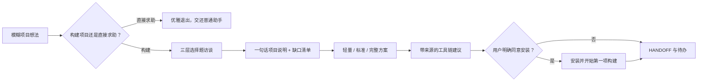

# Blindspot Finder 方法论深度审计与 BSC 对齐建议

> 审计日期：2026-07-26
> 输入：`C:\Users\34216\Downloads\blindspot-finder-main.zip`
> SHA-256：`0BC0ED9D23D06550B5A46447A2FB58E79DB253E7CE6BAAE5CD6AAF81E2FB2227`
> 范围：静态审阅全部 36 个归档条目、主 Skill、测试提示词、路线图和交接文档；未安装 Skill、未执行外部安装命令、未读取任何用户资料或凭据。

## 1. 结论

`blindspot-finder` 是一个“项目开始前需求挖掘”的对话式元 Skill，不是通用盲点检测器，也不是知识库、Agent 运行时或联网检索服务。它的产品本体是约束很强的 `SKILL.md`：先澄清用户是否真的要构建项目，再以低打字成本的多选访谈补全缺口，最后以带来源的工具链建议、明确同意门禁和 `HANDOFF.md` 交接收束。

它最值得吸收的不是“强制所有模糊描述都进入访谈”，而是以下可验证原则：

1. **缺口先于方案**：把未知事实、假设、风险和待决策项显式化，再生成 SOP 或技术方案。
2. **问题预算**：定性最多 2 问、补全最多 3 问、盲点探测只有 1 轮，避免把需求访谈变成消耗用户耐心的表单。
3. **用户认知负担最小化**：每题给可感知实例和“模糊回答/截图也可以”的出口，支持只回滚一题而非重做全部访谈。
4. **推荐必须可追溯**：实时检索后的具体链接、理由和来源，不能用记忆拼 URL；检索不可用时应明确降级。
5. **安装和副作用必须同意**：推荐、选择和实际安装严格分离。
6. **方案必须点火**：用户选定后进入实际执行，不把一份漂亮推荐单伪装成项目已经开始。

## 2. 真实架构

### 阶段一：范围和访谈

- 先进行“要构建还是要直接帮助”的歧义检查，避免误把普通答疑拦进项目管理流程。
- 启动模式把 Local-only、联网检索和解释密度一次合并为一个选择，避免连续配置问答。
- 三层分别覆盖项目类型/交付对象、全链路缺口、最高价值的隐藏假设；每层都有硬上限。
- 截图只是一种输入出口，且明确要求先脱敏；收到了需要材料的选择后必须停下等待，不能猜测。

### 阶段二：循证推荐和同意门禁

- 要求“现成方案优先”：先展示 2 至 3 个成熟产品，再让用户决定直接采用、二次开发还是自建。
- 要求稳定方案和新锐方案成对出现，并引用官方文档、仓库/注册表指标或方法公开的基准，而非 SEO 聚合页。
- 仅在用户选定方案层级后按链路寻找 Skill；安装命令必须来自本轮检索，且在明确同意前不得执行。

### 阶段三：执行与交接

- 提供不超过 8 行的进度板，使用户能跳过长文本仍看懂当前状态。
- `HANDOFF.md` 保存决策、目录、完成/未完成事项和下一步，目标是跨模型续接。
- `.blindspot-profile.md` 只保存流程偏好，不保存项目内容或个人信息。

## 3. 优点与局限

### 值得复用

- 将“用户不知道该问什么”转为有限、具体、可撤销的问题，而不是让模型替用户随意假设需求。
- 把不应做什么写为硬门禁：不联网时不可伪装为已验证；未同意不可安装；非构建任务立即退出。
- 识别“同一项目只在开题期由元 Skill 管辖”，完成交接后让领域 Skill 接管，这能降低多 Agent 抢控制权。

### 不能直接搬入 BSC

1. **它只有提示词，没有状态机**：问题预算、回滚、检索证据、安装同意和交接文件都是模型自律，没有数据库事务、审计事件或 API 强制。
2. **触发范围过宽**：任何模糊项目描述都强制开场，会阻碍 BSC 中用户已经要求“直接执行”的场景。BSC 不应把它作为全局系统提示词。
3. **“实时检索”不是能力实现**：包没有搜索、来源抓取、可信度策略、凭据隔离、缓存或失败重试；这些必须复用 BSC 的 Horizon/来源准入和引用账本。
4. **评测不足**：`test-prompts.json` 只有 3 条样例，没有执行器、标准化评分、负例矩阵或回归门禁。其路线图自己也将 20 至 30 条评测列为后续工作。
5. **文件交接不是权威状态**：直接在任意项目根目录写 `HANDOFF.md` 会与 BSC 的项目隔离、Vault 映射、运行账本和 Obsidian 受管文件语义冲突。

## 4. BSC 的正确接入位置

现有 BSC 已拥有更适合承接它的基础：DBOS 的 `MissionArtifact`/诊断缺口、自适应 SOP 编译器、项目知识 Profile、不可变来源、评测和权限门禁。正确接入是把 Blindspot 的交互方法落为 **DBOS Intake 的受管可选模式**，而不是安装另一个会抢占全局对话的 Skill。

| Blindspot 方法 | BSC 权威能力 | 接入约束 |
| --- | --- | --- |
| 构建/求助歧义判断 | DBOS Mission Intake | 只在用户显式新建 Mission 或请求需求澄清时出现；“直接执行”必须可跳过。 |
| 三层问题预算 | `dbos.diagnosis` 的 gaps/assumptions | 每题、答案修订和未答缺口持久化；SOP 不得把缺失值伪装为事实。 |
| 一句话项目说明 | `MissionArtifact` | 用户确认的目标、受众、约束和成功指标才进入任务上下文。 |
| 分层方案 | 自适应 SOP 编译结果 | 轻量/标准/完整是可审查选项，不是一次性生成的模板化文案。 |
| 工具/Skill 推荐 | Horizon/SourceRecord + 来源策略 | 每个建议带可解析来源、抓取时间、信任状态和适用边界；无法验证则明确不可推荐。 |
| 安装同意 | BSC 权限、外部 Worker/Capability policy | 任何安装、凭据、注册账号、外部命令都要求单独显式授权与审计。 |
| HANDOFF | Mission 状态、运行账本、受管 Vault 导出 | UI 从数据库读取真状态；只有用户批准的可读摘要才 materialize 到项目 Vault。 |
| 个人偏好 | `ProjectKnowledgeProfile` | 只保存语言、呈现密度、偏好渠道等明确允许的字段，不保存隐私推断。 |

## 5. 落地验收标准

将来实施 Blindspot Intake 时，完成不应以“出现了几个问题卡片”为准。至少应证明：

- 用户可选择直接执行、需求澄清或普通帮助，且每条路径不会错误进入另一条；
- 问题预算、回滚单题和未回答缺口在持久状态中可审查；
- 所有工具建议都有来源、适用理由、时间和可信度，离线时不会伪称实时验证；
- 选择的层级真正影响之后的 DBOS SOP 输入和执行边界；
- 未授权时不存在安装、文件写入、账号创建或外部调用；
- 真实项目从 Intake 到一个受评测的定制 SOP/执行计划可走通，并保留失败和拒绝状态；
- 至少有 20 条以上的正向、误触发、跳问、回滚、离线、同意和权限评测，且在 CI 中执行。

## 6. 最终建议

Blindspot Finder 能提升 BSC 的“项目开始前先问对问题”体验，尤其适合避免用户的 PRD/SOP 被固定模板吞没。但它不替代 Cangjie 的证据蒸馏、Horizon 的信息采集或 BSC 的治理链。应先把它当作 DBOS Intake 的可测试交互规范，复用现有 Mission、Profile、来源和权限模型；在有真实用户使用数据前，不应复制其全局触发规则或把 Prompt 声明当成已经实现的产品能力。
