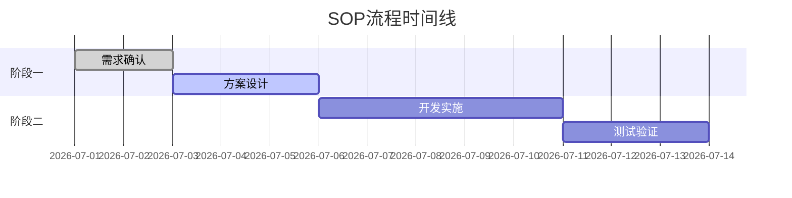
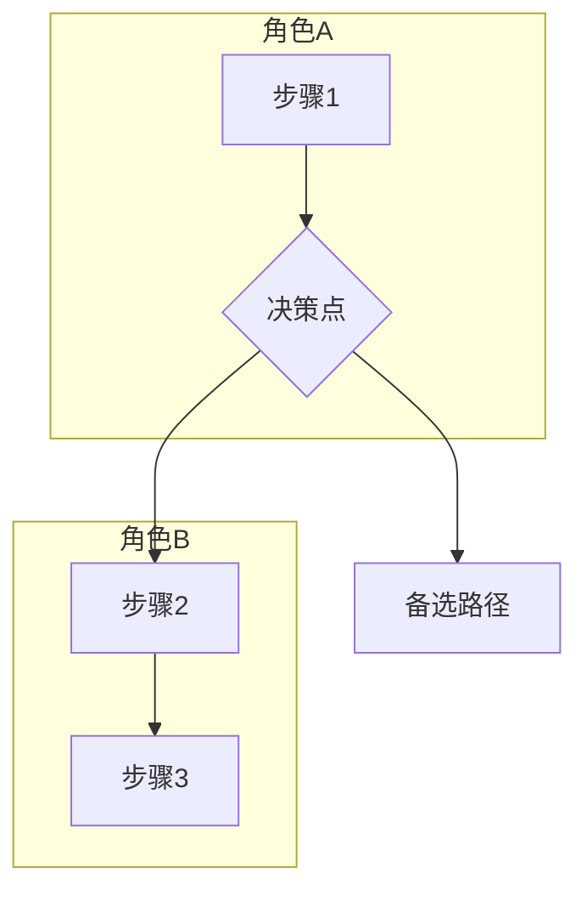

# SOP汇报增强优化设计文档

## 版本历史

| 版本 | 日期 | 作者 | 变更说明 |
|------|------|------|----------|
| v1.0 | 2026-07-09 | AI Agent | 初始设计 |

## 1. 需求概述

对现有的SOP汇报引擎进行三项核心增强：

1. **内容增强** - 添加关键成功因素、优化建议、度量指标、里程碑规划、成本估算等新模块
2. **可视化增强** - 改进流程图样式、添加甘特图、角色职责矩阵、风险热力图等
3. **智能分析增强** - 集成LLM进行智能摘要、风险评级、优化建议生成、异常检测等

## 2. 架构设计

### 2.1 整体架构

```
┌─────────────────────────────────────────────────────────────┐
│                    SOPReportEngine                          │
├─────────────────────────────────────────────────────────────┤
│  ┌─────────────────┐  ┌─────────────────┐  ┌─────────────┐ │
│  │  内容模块层      │  │  可视化模块层    │  │  智能分析层  │ │
│  │  (Content)      │  │  (Visual)       │  │  (AI)       │ │
│  ├─────────────────┤  ├─────────────────┤  ├─────────────┤ │
│  │ • Overview      │  │ • Flowchart     │  │ • Summary   │ │
│  │ • Workflow      │  │ • GanttChart    │  │ • RiskRate  │ │
│  │ • Roles         │  │ • RoleMatrix    │  │ • Optimize  │ │
│  │ • SLA           │  │ • RiskHeatmap   │  │ • Detect    │ │
│  │ • Risks         │  │ • SLAChart      │  │             │ │
│  │ • CSF (NEW)     │  │                 │  │             │ │
│  │ • Metrics (NEW) │  │                 │  │             │ │
│  │ • Milestones    │  │                 │  │             │ │
│  │ • CostEstimate  │  │                 │  │             │ │
│  └─────────────────┘  └─────────────────┘  └─────────────┘ │
├─────────────────────────────────────────────────────────────┤
│  ┌─────────────────┐  ┌─────────────────┐  ┌─────────────┐ │
│  │  导出层         │  │  LLM服务层       │  │  工具层     │ │
│  │  (Exporters)    │  │  (LLMService)   │  │  (Utils)    │ │
│  │ • Markdown      │  │ • DeepSeek      │  │ • Duration  │ │
│  │ • HTML          │  │ • Doubao        │  │ • CostCalc  │ │
│  │ • PPTX          │  │ • Mock          │  │             │ │
│  └─────────────────┘  └─────────────────┘  └─────────────┘ │
└─────────────────────────────────────────────────────────────┘
```

### 2.2 核心类设计

#### 2.2.1 SOPReportEngine（增强后）

| 方法 | 功能 | 新增/修改 |
|------|------|-----------|
| `generate_overview()` | 流程概览 | 保持不变 |
| `generate_workflow_detail()` | 详细流程 | 保持不变 |
| `generate_role_responsibilities()` | 角色职责 | 保持不变 |
| `generate_sla_summary()` | SLA汇总 | 保持不变 |
| `generate_risk_assessment()` | 风险评估 | 保持不变 |
| `generate_flowchart()` | 流程图 | 增强：支持泳道图 |
| `generate_csf()` | 关键成功因素 | **新增** |
| `generate_metrics()` | 度量指标 | **新增** |
| `generate_milestones()` | 里程碑规划 | **新增** |
| `generate_cost_estimate()` | 成本估算 | **新增** |
| `generate_ai_summary()` | 智能摘要 | **新增** |
| `generate_ai_recommendations()` | AI优化建议 | **新增** |
| `generate_full_sop_report()` | 完整汇报 | 增强：包含新模块 |
| `export_to_markdown()` | Markdown导出 | 增强：包含新模块 |
| `export_to_html()` | HTML导出 | 增强：包含新模块 |
| `export_to_pptx()` | PPTX导出 | 增强：包含新模块 |

#### 2.2.2 数据结构定义

##### 关键成功因素 (CSF)

```python
{
    "title": "关键成功因素",
    "description": "流程成功的关键要素",
    "factors": [
        {
            "id": "csf_001",
            "name": "技术能力",
            "description": "团队需具备XX技术能力",
            "impact": "高",
            "status": "已满足/部分满足/未满足",
            "actions": ["行动项1", "行动项2"]
        }
    ],
    "total_factors": 5
}
```

##### 度量指标

```python
{
    "title": "度量指标",
    "description": "流程效率、质量、成本的衡量标准",
    "efficiency_metrics": [
        {
            "name": "流程周期时间",
            "current": "48小时",
            "target": "24小时",
            "unit": "小时",
            "owner": "流程负责人"
        }
    ],
    "quality_metrics": [...],
    "cost_metrics": [...]
}
```

##### 里程碑规划

```python
{
    "title": "里程碑规划",
    "description": "流程执行的关键节点",
    "milestones": [
        {
            "id": "m_001",
            "name": "需求确认",
            "step_range": "1-2",
            "deadline": "T+2天",
            "status": "pending/completed/blocked"
        }
    ],
    "total_milestones": 4
}
```

##### 成本估算

```python
{
    "title": "成本估算",
    "description": "流程执行的人力和时间成本",
    "total_hours": 48,
    "total_fte": 2.0,
    "estimated_cost": "¥48,000",
    "breakdown": [
        {
            "role": "角色A",
            "hours": 24,
            "cost": "¥24,000",
            "steps": ["步骤1", "步骤2"]
        }
    ]
}
```

##### 智能摘要

```python
{
    "title": "智能摘要",
    "description": "LLM生成的汇报核心要点",
    "executive_summary": "一句话核心摘要",
    "key_findings": ["关键发现1", "关键发现2"],
    "recommendations": ["建议1", "建议2"],
    "risk_highlights": ["高风险项1", "高风险项2"]
}
```

## 3. 可视化设计

### 3.1 甘特图 (Mermaid)



### 3.2 角色职责矩阵

```
          | 步骤1 | 步骤2 | 步骤3 | 步骤4 |
----------|-------|-------|-------|-------|
角色A     | 负责  |       | 审核  |       |
角色B     |       | 负责  |       | 负责  |
角色C     | 参与  | 参与  |       | 审核  |
```

### 3.3 风险热力图

使用SVG实现，横轴为概率，纵轴为严重程度：

```
          低    中    高
        +----------------+
高风险  |      |  ●   |  ●  |
        +----------------+
中风险  |  ●   |  ●   |     |
        +----------------+
低风险  |  ●   |      |     |
        +----------------+
```

### 3.4 流程图增强

支持决策节点和泳道图：



## 4. LLM集成设计

### 4.1 智能摘要生成

**Prompt设计**：
```
你是一个专业的业务流程分析师。请基于以下SOP流程数据，生成一份简明扼要的执行摘要：

流程数据：{流程JSON数据}

要求：
1. 用一句话概括流程的核心目标
2. 列出3-5个关键发现
3. 提出2-3条优化建议
4. 指出1-2个高风险点

输出格式：JSON
```

### 4.2 风险评级

**Prompt设计**：
```
你是一个风险评估专家。请对以下风险项进行评级：

风险列表：{风险JSON列表}

要求：
1. 对每个风险项进行评级（高/中/低）
2. 计算风险分数（1-10分）
3. 提供评级理由

输出格式：JSON
```

### 4.3 优化建议生成

**Prompt设计**：
```
你是一个流程优化专家。请基于以下SOP流程数据，提出具体的优化建议：

流程数据：{流程JSON数据}

要求：
1. 分析流程中的瓶颈点
2. 提出具体的改进措施
3. 预估改进效果
4. 给出实施优先级

输出格式：JSON
```

## 5. API接口设计

### 5.1 现有接口增强

**POST /sop-report/generate**

增强响应内容，新增字段：
- `csf` - 关键成功因素
- `metrics` - 度量指标
- `milestones` - 里程碑规划
- `cost_estimate` - 成本估算
- `ai_summary` - 智能摘要
- `ai_recommendations` - AI优化建议

### 5.2 新增独立接口

| 接口 | 方法 | 功能 |
|------|------|------|
| `/sop-report/csf` | POST | 单独生成关键成功因素 |
| `/sop-report/metrics` | POST | 单独生成度量指标 |
| `/sop-report/milestones` | POST | 单独生成里程碑规划 |
| `/sop-report/cost` | POST | 单独生成成本估算 |
| `/sop-report/ai-summary` | POST | 单独生成智能摘要 |
| `/sop-report/ai-recommendations` | POST | 单独生成AI优化建议 |

## 6. 导出格式增强

### 6.1 Markdown导出增强

新增章节：
- 7. 关键成功因素
- 8. 度量指标
- 9. 里程碑规划
- 10. 成本估算
- 11. 智能摘要
- 12. AI优化建议

### 6.2 HTML导出增强

新增可视化组件：
- 甘特图（Mermaid渲染）
- 角色职责矩阵（表格）
- 风险热力图（SVG）
- 流程图（Mermaid渲染）

### 6.3 PPTX导出增强

新增幻灯片：
- 关键成功因素幻灯片
- 度量指标幻灯片（图表）
- 里程碑规划幻灯片（甘特图）
- 成本估算幻灯片（柱状图）
- 智能摘要幻灯片

## 7. 测试策略

### 7.1 单元测试

| 测试模块 | 测试内容 |
|----------|----------|
| 内容模块 | CSF生成、度量指标生成、里程碑生成、成本估算 |
| 可视化模块 | 甘特图生成、角色矩阵生成、风险热力图生成 |
| 智能分析模块 | AI摘要生成、风险评级、优化建议生成 |
| 导出模块 | 新增内容的Markdown/HTML/PPTX导出 |

### 7.2 集成测试

- API接口集成测试
- LLM服务集成测试（mock模式）
- 完整汇报生成测试

## 8. 实施计划

### Phase 1: 内容增强（预计1天）
1. 实现 `generate_csf()` 方法
2. 实现 `generate_metrics()` 方法
3. 实现 `generate_milestones()` 方法
4. 实现 `generate_cost_estimate()` 方法

### Phase 2: 可视化增强（预计1天）
1. 增强 `generate_flowchart()` 方法（泳道图支持）
2. 实现甘特图生成方法
3. 实现角色职责矩阵生成方法
4. 实现风险热力图生成方法

### Phase 3: 智能分析增强（预计1天）
1. 集成LLM服务到SOPReportEngine
2. 实现 `generate_ai_summary()` 方法
3. 实现 `generate_ai_recommendations()` 方法
4. 实现风险自动评级功能

### Phase 4: API和导出增强（预计1天）
1. 更新API接口
2. 更新Markdown导出
3. 更新HTML导出
4. 更新PPTX导出

### Phase 5: 测试和验证（预计0.5天）
1. 编写单元测试
2. 运行集成测试
3. 验证端到端流程

## 9. 依赖说明

| 依赖 | 版本 | 用途 |
|------|------|------|
| python-pptx | >=0.6.20 | PPTX导出 |
| mermaid | - | 图表渲染（前端） |
| LLM服务 | - | 智能分析 |

## 10. 风险和注意事项

1. **LLM调用成本**：智能分析功能会增加LLM调用次数，建议在配置中提供开关控制
2. **性能影响**：完整汇报生成可能需要更多时间，建议提供异步生成选项
3. **数据安全**：LLM调用时注意敏感数据脱敏
4. **mock模式支持**：确保智能分析功能在mock模式下也能正常工作
