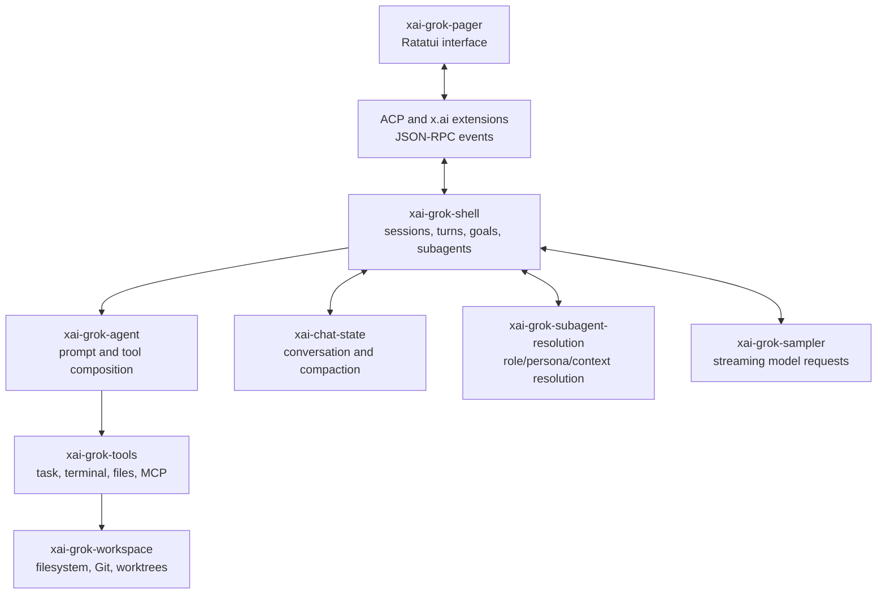
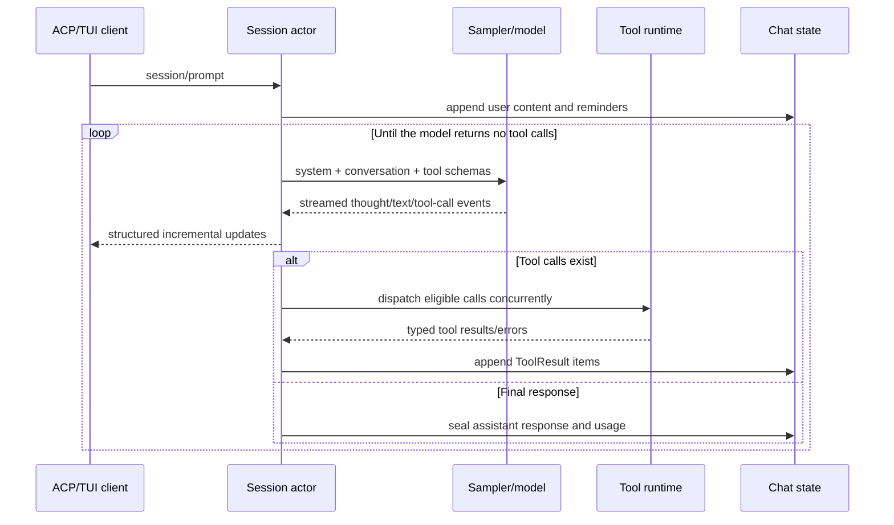
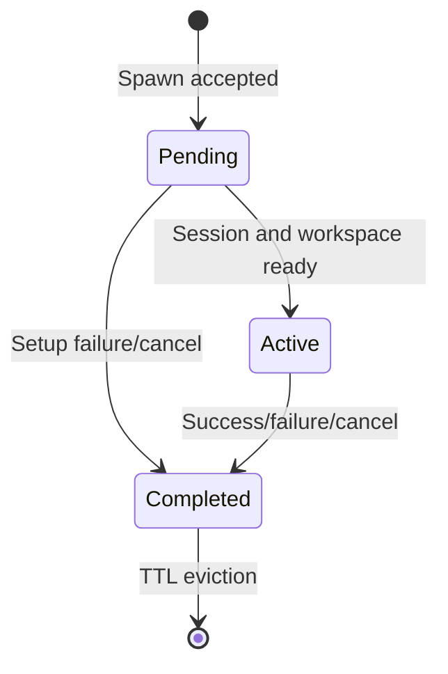
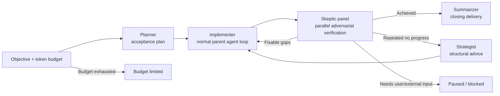
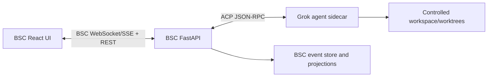

# Grok Build Architecture and Secondary Development Analysis

**Date:** 2026-07-20

**Source archive:** `C:\Users\34216\Downloads\grok-build-main.zip`

**Archive SHA-256:** `7DA49C9E9CE146E84D1B74619B3ED029A6EFB38765B6C30E26B7120C21B7387E`

**Upstream source revision:** `2ec0f0c8488842da03a71eeee3c61154957ca919`

**Analyzed source:** `C:\Users\34216\AppData\Local\Temp\grok-build-main-analysis\grok-build-main`

**Scope:** Runtime architecture, task orchestration, multi-agent collaboration,
TUI interaction, ACP integration, and a practical BSC secondary-development path.

## 1. Executive Conclusion

Grok Build is not a conventional web application. It is a Rust workspace that
combines an agent runtime, tool runtime, durable conversation state, workspace
isolation, the Agent Client Protocol (ACP), and a Ratatui terminal interface.

Its most important architectural decision is that a subagent is a real child
session, not a role simulated inside the parent's prompt. Each child can have
its own model, context window, transcript, tools, capability boundary,
cancellation token, usage accounting, and Git worktree. The parent and children
coordinate through typed events and explicit lifecycle state.

For BSC, the recommended path is not a Rust rewrite. Preserve the current
FastAPI/React product and transfer the following contracts:

1. Durable `AgentSession` and `ChildTask` projections.
2. One typed orchestration event stream shared by persistence, APIs, and UI.
3. Foreground/background task semantics with automatic background promotion.
4. Fresh/fork/resume context policies.
5. Capability and workspace isolation as execution policy, not prompt advice.
6. Planner/implementer/skeptic/strategist/summarizer goal closure.
7. A React event reducer and navigable child-session transcript.

## 2. Repository Layers



| Crate | Responsibility |
| --- | --- |
| `xai-grok-pager` | TUI state, rendering, prompt editor, dashboard, task panes |
| `xai-grok-shell` | Session actors, turn loop, ACP host, subagent coordinator, `/goal` |
| `xai-grok-agent` | Effective system prompt, tool definitions, skills, hosted tools |
| `xai-chat-state` | Conversation items, usage, compaction, malformed tool-call repair |
| `xai-grok-tools` | Local tools and the `TaskTool` used to spawn/query/cancel children |
| `xai-grok-subagent-resolution` | Agent type, role, persona, model, context and isolation resolution |
| `xai-grok-sampler` | Streaming model invocation and sampling events |
| `xai-grok-workspace` | Filesystem, terminal, Git, checkpoint and worktree backends |
| `xai-agent-lifecycle` | Lifecycle extension points around session and turn execution |

The composition root is `xai-grok-pager-bin`. The root `Cargo.toml` is
generated and intentionally treats individual crates as the ownership units.

## 3. Single-Agent Execution Loop

The core turn is a repeated model/tool loop rather than one model call:



Important properties:

- Streaming is first-class. Text, reasoning, tool start, tool progress, and tool
  completion are emitted as events while the turn is still active.
- Multiple tool calls from one model response can execute concurrently through
  `FuturesUnordered`; result ordering is reconciled before the next sample.
- Tools are dispatched through one bridge, which centralizes permissions,
  cancellation, truncation, telemetry, and tool-result formatting.
- The transcript is the control state. Tool results are written back as typed
  conversation items, then the model is sampled again.
- Structured-output tool calls are intercepted and validated as protocol, not
  executed as ordinary tools.

Primary source: `xai-grok-shell/src/session/acp_session_impl/turn.rs`,
`tool_calls.rs`, and `tool_dispatch.rs`.

## 4. Task Orchestration and Multi-Agent Collaboration

### 4.1 TaskTool is the orchestration API

The parent model delegates by calling `TaskTool`. A spawn request carries a
task id, parent session/prompt ids, description, full prompt, agent type,
background flag, capability mode, isolation mode, optional model, optional
`resume_from`, and optional working directory.

The same subsystem supports:

- spawn in foreground or background;
- query once or wait with timeout;
- cancel one child or all children of a parent prompt;
- list active children;
- drain completed children;
- validate and describe an agent type before spawn.

Task ids use UUID v7, making them globally unique and time-sortable. Recursive
fan-out is deliberately bounded: `MAX_SUBAGENT_DEPTH` is `1`, so child agents
cannot recursively create grandchildren. This is a cost and control boundary.

### 4.2 Coordinator state and event bus



The coordinator owns three maps: `pending`, `active`, and `completed`. All
commands enter through one typed `SubagentEvent` channel. Spawn handling is put
on a separate local task so one slow child setup does not block query, cancel,
or unrelated spawn events.

This yields a useful separation:

- `TaskTool` is the model-facing command API.
- `SubagentEvent` is the runtime command bus.
- `SubagentCoordinator` is authoritative lifecycle state.
- ACP/xAI notifications are the UI-facing read model.

### 4.3 Foreground is bounded waiting, not ownership

Foreground mode waits only for a configured budget. If the child exceeds that
budget, the runtime does not kill it. It promotes the child to background and
returns its task id, allowing the parent to continue and query it later.

This prevents a long child from blocking the parent's entire response while
preserving useful work. Background mode returns immediately with the same id.

### 4.4 Independent child sessions

Each child is spawned as a hidden session with independent:

- chat state and context window;
- transcript and persisted session metadata;
- effective model and reasoning effort;
- tool registry and capability mode;
- cancellation and parent-prompt linkage;
- token/usage accounting;
- working directory or isolated worktree.

Parent cancellation can target the current prompt's child set. Terminal events
are sealed exactly once, which avoids duplicate completion accounting and UI
flicker after races or reconnects.

### 4.5 Context policies

| Policy | Behavior | Best use |
| --- | --- | --- |
| Fresh | No inherited transcript | Independent research or unbiased review |
| Forked | Parent history becomes cleaned background context | Child needs current decisions and constraints |
| Resumed | Rehydrates a completed peer's transcript and runtime identity | Multi-stage continuation with full prior work |

Fork normalization keeps at most the latest three complete turns verbatim,
summarizes older turns, and removes repeated system reminders, user info, Git
status, project layout, attachments, and parent-only skill instructions. The
new task prompt is appended last for maximum recency.

Resume is stricter than fork. It validates identity compatibility, preserves
the source model/persona where required, and fails closed when an explicit
resume cannot be reconstructed. This prevents silently starting a fresh child
when the caller expects continuity.

### 4.6 Capability and workspace isolation

Capability mode is enforced by tool availability:

| Mode | Read | Write | Execute |
| --- | --- | --- | --- |
| `read-only` | yes | no | no |
| `read-write` | yes | yes | no |
| `execute` | yes | no | yes |
| `all` | yes | yes | yes |

`isolation=worktree` creates a separate Git worktree. It is mutually exclusive
with an explicit `cwd`. This lets multiple implementation agents edit in
parallel without sharing uncommitted filesystem state. Isolation is therefore
both a security boundary and a concurrency primitive.

## 5. The `/goal` Closed-Loop Orchestrator

`/goal` is a higher-level harness built on the same child-session machinery:



Role semantics:

- **Planner:** produces the acceptance/verification plan before implementation.
  Planner failure is fail-closed and pauses the goal.
- **Implementer:** the primary session performs actual tool-driven work.
- **Skeptics:** one to five independent, mostly cold child sessions verify the
  workspace and evidence in parallel. Default panel size is three.
- **Strategist:** fires after repeated `NotAchieved` verdicts and writes advice
  without taking ownership of the implementation plan. It is fail-open.
- **Summarizer:** runs once after verified achievement and produces the closing
  delivery summary. It is read-only and fail-open.

The verifier does not simply trust the implementer's prose. It receives the
objective, current response, Git baseline, planner baseline, workspace, prior
gaps, and per-role scratch directories. Skeptics can re-run checks and write
independent evidence without overwriting each other.

The quorum is deliberately asymmetric. Skeptic 0 is a persistent gatekeeper
that may resume across rounds; a high-confidence refutation from it is
decisive. Other cold skeptics provide a majority check. `Blocked` is used only
when all refuting evidence is non-model-fixable; otherwise the result remains
`NotAchieved` and feeds concrete gaps into the next implementer round.

The loop also has:

- token budget enforcement;
- maximum verifier attempts;
- repeated-gap fingerprint stall detection;
- blocked and continuation streaks;
- pause/resume state;
- immutable original-plan baseline;
- persisted verifier details and strategy notes;
- cancellation linkage to the active parent prompt.

One design should not be copied blindly into BSC: infrastructure-class verifier
failures can become `FailOpenAchieved` in Grok Build. For business decisions or
high-risk production changes, BSC should normally report `verification_error`
or pause, not convert missing verification into success.

## 6. TUI Architecture and Interaction Design

The UI follows an Elm-style unidirectional loop:

```text
Input/ACP Event -> Action -> dispatch(state mutation) -> Effect
                <- Action <- TaskResult <- async execution
```

`Action` represents intent, `dispatch` synchronously mutates `AppView`, `Effect`
describes asynchronous work, and `TaskResult` returns completion into the same
dispatcher. Rendering reads state but does not perform runtime work. This makes
keyboard, mouse, ACP, timers, and async completion follow one path.

The TUI does not reach into the runtime's internal maps. It consumes structured
ACP plus `x.ai/*` extension events. In particular:

- `SubagentSpawned` creates `SubagentInfo` and a read-only child `AgentView`.
- `SubagentProgress` updates status, current activity, and usage projection.
- `SubagentFinished` seals duration/result and removes transient running state.
- The parent scrollback contains a compact lifecycle block.
- Selecting the block opens the full child transcript.

The information hierarchy has three levels:

1. **Dashboard:** all top-level agents, grouped/sorted by state, with dispatch,
   search, peek, reply, attach, pin, rename, and stop.
2. **Agent session:** transcript, reasoning/tool lifecycle, prompt editor,
   permissions, queue, tasks pane, todo pane, and plan state.
3. **Subagent detail:** read-only full transcript reachable from the parent.

Notable interaction decisions:

- `Ctrl+B` opens tasks; `Ctrl+T` opens todos; dashboard has its own overview.
- The same `PromptWidget` is reused for normal chat, dashboard dispatch, and
  peek reply, preserving paste, multiline, file mention, and editing behavior.
- Busy-agent replies are queued rather than rejected.
- Permission and ask-user requests become structured option UI.
- Dispatch always means a new top-level session; reply always targets the
  selected session. The visual modes make this distinction explicit.
- Dashboard rows prioritize state and current activity over decorative data.

For a React implementation, preserve the unidirectional event model and
navigation hierarchy, not the terminal-specific keybindings or rendering code.

## 7. Secondary-Development Options

### Option A: Configuration extension

Use project/user agent Markdown, role/persona TOML, skills, hooks, plugins, and
MCP servers. This is the fastest route when the runtime behavior is sufficient
and only roles, tools, prompts, or integrations need customization.

Use this for proof-of-concept BSC roles such as researcher, business architect,
risk skeptic, and evidence verifier before changing Rust.

### Option B: ACP sidecar with the existing BSC UI (recommended)

Run `grok agent stdio` locally or `grok agent serve` behind a backend-only
WebSocket connection. Do not expose the ACP secret to the browser.



The FastAPI adapter should own ACP process lifecycle, authentication, request
correlation, permission policy, event normalization, persistence, reconnect,
and tenant/project authorization. React should consume BSC-owned domain events,
not raw untrusted `x.ai/*` payloads.

This route preserves Grok's real runtime and lets BSC build a domain-specific
web experience. It also leaves open a future migration from the Grok sidecar
to a Python-native runtime behind the same BSC event contract.

### Option C: Deep Rust fork

Fork `xai-grok-shell`, `xai-grok-tools`, and `xai-grok-pager` only when product
requirements require changing lifecycle semantics, tool execution, ACP
extensions, or the TUI itself. This has the highest maintenance cost because
the repository is a periodically synced monorepo snapshot, the workspace root
is generated, external contributions are not accepted, and Windows builds are
best-effort.

## 8. Recommended BSC Target Architecture

Existing BSC foundations already cover part of the target:

| BSC module | Reuse |
| --- | --- |
| `app/orchestrator/runtime_engine.py` | Parent pipeline execution entry point |
| `app/orchestrator/event_store.py` | Durable event append/replay |
| `app/orchestrator/recovery.py` | Orphan detection and terminal recovery |
| `app/capabilities/runner.py` | Capability planning/routing |
| `app/capabilities/executor.py` | Bounded tool/model execution policy |
| `src/components/UnifiedWorkspace.tsx` | Current streaming workspace shell |

Add one canonical model instead of a parallel orchestrator:

```text
AgentSession
  id, parent_session_id, parent_task_id, project_id, status,
  role, persona, model, context_policy, capability_mode,
  isolation_mode, workspace_ref, usage, created_at, finished_at

ChildTask
  id, parent_session_id, parent_prompt_id, child_session_id,
  description, status, foreground, foreground_deadline,
  result_summary, error, created_at, started_at, finished_at
```

Recommended domain events:

```text
session.created / session.status_changed / session.message_delta
tool.started / tool.progress / tool.finished
child.requested / child.spawned / child.progress / child.finished
permission.requested / permission.resolved
goal.created / goal.planned / goal.verifying / goal.verdict
goal.strategy_proposed / goal.completed / goal.paused / goal.budget_limited
```

Frontend state should be a reducer keyed by `session_id` and monotonic event
sequence. The first useful UI increment is:

1. Left session/dashboard rail for top-level runs.
2. Center transcript with model, reasoning, tool, and child lifecycle blocks.
3. Right task/todo panel with foreground/background status.
4. Child transcript route or drawer opened from a lifecycle block.
5. Structured permission, blocked, resume, cancel, and queued-message states.

## 9. Delivery Phases and Acceptance Gates

### Phase 1: Protocol and projection

- Define the canonical session/task/event contracts.
- Persist parent-child linkage and terminal state exactly once.
- Add query, wait, cancel, list, and reconnect/replay tests.
- Keep current orchestration endpoints backward-compatible.

### Phase 2: Child-session runtime

- Implement fresh/fork/resume policies.
- Enforce capability modes at the executor/registry boundary.
- Add foreground deadline with automatic background promotion.
- Add per-child usage and cancellation accounting.

### Phase 3: Goal closure

- Persist acceptance plan and immutable baseline.
- Fan out independent verifier sessions and aggregate typed verdicts.
- Feed verified gaps into the next implementation round.
- Add strategist cadence, budget, pause/resume, and fail-closed infra behavior.

### Phase 4: React agent workspace

- Replace ad hoc log accumulation with an event reducer.
- Add dashboard, task pane, lifecycle blocks, and child transcript navigation.
- Add structured permissions, queueing, blocked resolution, and reconnect UI.
- Verify desktop/mobile layout, long text, concurrent updates, and stale events.

The system is not complete merely because agents can be spawned. Completion
requires durable replay, cancellation races, duplicate terminal suppression,
permission enforcement, context isolation, reconnect behavior, and UI access to
the evidence behind each child result.

## 10. Licensing and Product Boundaries

First-party Grok Build code is Apache-2.0. A fork may modify and redistribute
it while preserving the license, copyright and applicable NOTICE/third-party
notices, and clearly marking modifications. Vendored and ported code retains
its own licenses and must be reviewed through `THIRD-PARTY-NOTICES`.

The source-code license does not automatically grant xAI trademarks, hosted
service access, model credentials, or permission to redistribute secrets and
branding. Treat the Grok API/auth/service relationship as a separate product
and commercial boundary.

## 11. Key Source Map

- Agent loop: `crates/codegen/xai-grok-shell/src/session/acp_session_impl/turn.rs`
- Parallel tools: `crates/codegen/xai-grok-shell/src/session/acp_session_impl/tool_calls.rs`
- Tool dispatch: `crates/codegen/xai-grok-shell/src/session/acp_session_impl/tool_dispatch.rs`
- Task tool: `crates/codegen/xai-grok-tools/src/implementations/grok_build/task/mod.rs`
- Task/event types: `crates/codegen/xai-grok-tools/src/implementations/grok_build/task/types.rs`
- Coordinator: `crates/codegen/xai-grok-shell/src/agent/mvp_agent/subagent_coordinator.rs`
- Child lifecycle: `crates/codegen/xai-grok-shell/src/agent/subagent/`
- Fork normalization: `crates/codegen/xai-grok-subagent-resolution/src/context.rs`
- Goal loop: `crates/codegen/xai-grok-shell/src/session/acp_session_impl/goal.rs`
- Verifier panel: `crates/codegen/xai-grok-shell/src/session/goal_classifier.rs`
- Planner/strategist/summarizer: `crates/codegen/xai-grok-shell/src/session/goal_*.rs`
- TUI actions/effects: `crates/codegen/xai-grok-pager/src/app/actions.rs`, `effects/`
- TUI dispatcher: `crates/codegen/xai-grok-pager/src/app/dispatch/router.rs`
- Subagent UI updates: `crates/codegen/xai-grok-pager/src/app/acp_handler/session_notification.rs`
- ACP guide: `crates/codegen/xai-grok-pager/docs/user-guide/15-agent-mode.md`
- Subagent guide: `crates/codegen/xai-grok-pager/docs/user-guide/16-subagents.md`
- Dashboard guide: `crates/codegen/xai-grok-pager/docs/user-guide/23-dashboard.md`

## 12. Phase 2 Supplement: Terminal, Context, Plugins and MCP

The archive contains 2,736 files in a generated Rust workspace. The relevant
behavior is divided across narrow crates rather than hidden in one monolith.

### 12.1 Visual terminal interface

`xai-grok-pager` is the application shell. `xai-grok-pager-render` owns terminal
rendering and appearance, while `ptyctl` owns PTY sessions and
`xai-grok-pager-pty-harness` verifies real screen behavior. The important
pattern for BSC is not Ratatui itself; it is the unidirectional event loop:

```text
event -> action -> state reducer -> async effect -> result event -> render
```

Grok keeps dashboard, parent transcript, child transcript, tool progress,
permissions, queue state and scrollback as separate projections. A compact
child lifecycle block links to a full transcript instead of flooding the main
conversation. BSC's React workspace should follow the same hierarchy using its
existing durable orchestrator SSE stream.

### 12.2 Context management

`xai-chat-state` serializes mutations through an actor task and persists the
conversation. Its state includes token estimates, usage, prompt capture,
rewind metadata, credential opacity and harness traces. Startup repairs
duplicate tool results and dangling tool calls caused by cancellation or crash.

`xai-grok-compaction` separates policies:

- full-replace for code-agent sessions;
- tail-keep intra-turn compaction;
- chunked inter-turn compaction;
- history filtering and user-query preservation.

The shared selector snaps away from tool-result pairs, so compaction never
creates an invalid model request. BSC already has deterministic prompt budgets;
the Phase 2 implementation adds explicit `fresh`, `fork` and `resume` policies
on that boundary instead of introducing a second conversation store.

### 12.3 Skill and plugin ecosystem

The marketplace scanner prefers a signed/indexed catalog and falls back to
filesystem discovery. A plugin entry can advertise skills, hooks, agents and
MCP configuration, plus keywords/domains used for matching. Install resolution
is separate from discovery, and relative paths are canonicalized with root and
symlink checks.

BSC's existing frontend `SkillManager` already models execution and dependency
plans, but the backend list is hardcoded and process-local execution metadata is
not a plugin contract. The Phase 2 registry adds manifest discovery and source
provenance while keeping execution behind the existing capability and LLM
policy gates.

### 12.4 MCP compatibility layers

The Grok stack has two useful boundaries. `xai-grok-mcp` handles wire/server
discovery, HTTP/SSE, OAuth and ACP transport. The computer-hub adapter handles
the semantic bridge: `initialize`, `tools/list`, one typed handler per tool,
`tools/call`, and conversion of text/image/resource/error blocks into the local
tool output wire format.

BSC's `app.mcp.server` already exposes real FastMCP stdio tools and isolates
business execution in a subprocess with timeout and resource limits. Phase 2
adds an explicit compatibility profile and normalization layer so supported
and unsupported transports/capabilities are inspectable rather than implied.

The execution plan and acceptance criteria for this supplement are recorded in
`docs/superpowers/specs/2026-07-21-grok-build-secondary-development-phase2.md`.
