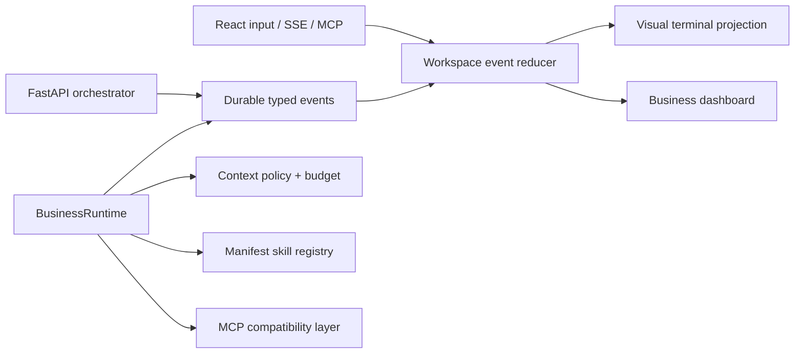

# Grok Build Secondary Development Phase 2

**Status:** Implemented and verified
**Date:** 2026-07-21
**Source:** `C:\Users\34216\Downloads\grok-build-main.zip`
**Related report:** `docs/superpowers/specs/2026-07-20-grok-build-architecture-and-secondary-development.md`

## Objective

补充 Grok Build 的可视化终端界面、上下文管理、Skill 插件生态和 MCP
兼容层分析，并把与现有 BSC FastAPI/React/BusinessRuntime 边界匹配的部分
落地。目标是获得相同的工程行为契约，不把 Rust TUI 或 Grok 专有服务直接
复制进 BSC，避免形成不能运行的平行壳层。

## Evidence From Grok Build

### Visual terminal

- `xai-grok-pager` owns the full-screen Ratatui application, prompt editor,
  dashboard, modal state, scrollback, tool blocks, task panes, and settings.
- `xai-grok-pager-render` separates terminal probing, ANSI/Markdown/code/image/
  Mermaid rendering, hyperlinks, themes, selection, and safe buffers from the
  application state.
- `ptyctl` and `xai-grok-pager-pty-harness` provide a real terminal process,
  scripted input, screen snapshots, scroll invariants, resize storms, and
  persistence tests. The UI is verified through behavior, not only component
  snapshots.
- The state flow is `Input/ACP event -> Action -> reducer -> Effect ->
  TaskResult -> Action`; rendering never owns runtime work.

### Context management

- `xai-chat-state` is an actor with exclusive mutable conversation state,
  persistence, usage ledger, rewind capture, tool-call repair, and event
  notifications. Readers query a handle instead of mutating shared maps.
- `xai-grok-compaction` has separate full-replace, history, inter-turn, and
  intra-turn strategies. Selection never splits an assistant tool request from
  its tool results.
- Fork, fresh, and resume are explicit policies. Fork removes parent-only
  instructions and old repeated context; resume validates identity instead of
  silently starting a new session.

### Skill/plugin ecosystem

- `xai-grok-plugin-marketplace` loads an indexed catalog first and falls back to
  filesystem scanning. Entries describe skills, hooks, agents, MCP, keywords,
  domains, version and provenance.
- Marketplace paths are parsed and canonicalized before joining a root, with
  symlink escape checks. Installation and discovery are separate operations.
- `xai-hooks-plugins-types` is the typed component contract; hooks and skills
  are discoverable data until an execution policy explicitly enables them.
- BSC's current `SkillManager` is a useful client-side execution coordinator,
  but backend `/api/skill/list` is still a hardcoded list and its execution
  state is process-local. Phase 2 adds manifest discovery and provenance while
  retaining the existing execution API.

### MCP compatibility layers

```text
Transport (stdio / HTTP stream)
        -> JSON-RPC initialize, tools/list, tools/call
        -> typed tool/content normalization
        -> capability/auth/isolation policy
        -> BSC capability executor and event projection
```

- `xai-grok-mcp` owns wire/server discovery, HTTP/SSE, OAuth configuration,
  credentials and ACP transport concerns.
- `xai-computer-hub-mcp-adapter` uses an `McpTransport` seam, performs
  initialize plus tools/list, creates one typed handler per tool, and maps
  text/image/resource content back to a common tool output wire type.
- BSC already has a stdio FastMCP server and an isolated subprocess runner.
  Phase 2 adds an explicit compatibility profile and normalization seam so
  callers can inspect supported protocol layers without coupling business code
  to FastMCP internals.

## Target BSC Architecture



### Canonical contracts

1. `ContextPolicy`: `fresh`, `fork`, `resume`.
2. `TerminalEvent`: a renderable projection of a typed runtime event; it is
   append-only, sequence-ordered, and never inferred from a timer.
3. `SkillManifest`: id, version, description, source, inputs, outputs, prompt
   body, hooks, agents and MCP references; filesystem discovery is fail-closed
   for unsafe paths.
4. `McpCompatibilityProfile`: transport, protocol methods, content blocks,
   auth mode and isolation mode supported by the BSC adapter.

## Execution Plan

### Phase A: analysis and contracts

- [x] Extract the archive and map the relevant crates.
- [x] Extend the architecture report with terminal, context, plugin and MCP
  evidence.
- [x] Define this implementation Spec and its acceptance gates.

### Phase B: backend foundations

- [x] Add explicit context policies and deterministic fork/resume normalization
  on top of the existing prompt budget.
- [x] Add safe Skill manifest discovery with built-in and project-local
  provenance, without executing untrusted manifest content.
- [x] Add a typed MCP compatibility profile and content normalization seam.
- [x] Add focused contract tests for all three foundations.

### Phase C: visual terminal workspace

- [x] Extend the existing orchestrator event contract with renderable tool,
  child and terminal metadata without changing terminal job semantics.
- [x] Add a React event reducer and terminal-style live panel wired to the same
  SSE stream as the dashboard.
- [x] Preserve reconnect, stale-event rejection, error, cancellation, and
  mobile layout behavior.

### Phase D: acceptance

- [x] Python focused and full regression tests pass.
- [x] TypeScript check, ESLint and production build pass.
- [x] Contract tests prove context isolation, manifest path safety, MCP result
  normalization, and terminal event ordering.
- [x] Worklog records implementation evidence and residual non-goals.

## Non-goals

- Do not vendor the 2,736-file Rust workspace into BSC.
- Do not implement a general-purpose arbitrary shell/PTY service in the first
  phase; the BSC terminal panel is a controlled runtime-event projection.
- Do not execute arbitrary code from a downloaded Skill manifest.
- Do not claim full MCP transport support until a concrete transport adapter is
  implemented and tested; the compatibility profile must report unsupported
  layers explicitly.
- Do not modify the already accepted platform-convergence lifecycle semantics.

## Acceptance Criteria

1. A user can see live, ordered runtime activity in a terminal-style panel and
   the panel reconnects from the last event sequence.
2. A capability can receive a bounded `fresh`, `fork`, or `resume` context with
   no parent-session leakage and observable budget metadata.
3. Project-local Skill manifests appear through the existing skill API with
   source/provenance and cannot escape their configured root.
4. MCP compatibility is represented by typed metadata and content normalization;
   text, image, resource and error results preserve their meaning.
5. Existing orchestrator, dashboard, production LLM policy and MCP stdio
   behavior remain backward compatible.

## Implementation Evidence

- `app/core/context_policy.py` implements bounded `fresh`, `fork`, and
  `resume` packets with observable usage metadata. The API validates parent
  session identity, terminal state, tenant, project, and browser scope.
- `app/skills/manifest.py` and `app/skills/registry.py` discover typed
  `SKILL.md` manifests, reject unsafe paths and symlink escapes, expose
  provenance through `/api/skill/list`, and execute only approved `chain:`
  entrypoints. `skills/business-discovery/SKILL.md` is a working project
  manifest example.
- `app/mcp/compatibility.py` reports actual stdio/API-key/subprocess support,
  explicitly reports HTTP/SSE and OAuth as unsupported, and normalizes text,
  image, resource/resource-link, and error blocks. The profile is exposed by
  `bsc_mcp_compatibility_profile`.
- `app/orchestrator/runtime_engine.py` emits ordered capability completion or
  failure events with parent-stage and execution metadata. The React
  `terminalEventReducer` rejects duplicate, stale, and cross-session events;
  `AgentTerminal` renders the same SSE stream with mobile-safe layout.
- Verification: `635 passed, 3 skipped`; `npm run check`; `npm run lint` with
  zero errors; `npm run build`; `scripts/quality_inventory.py`; and
  `git diff --check` all pass.
